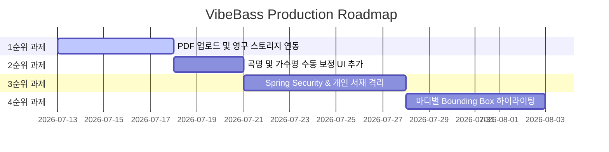

# 📋 VibeBass 실서비스 출시를 위한 남은 개발 과제 백로그 명세서 (PROJECT_BACKLOG)

본 문서는 VibeBass 플랫폼을 프로토타입(MVP) 단계에서 정식 릴리즈(Production Release) 수준으로 격상하기 위해 반드시 구현해야 할 핵심 기술 스펙과 백로그(Backlog) 리스트를 정의합니다.

---

## 📌 핵심 백로그 우선순위 및 세부 구현 설계



---

## 📂 백로그 1순위: PDF 악보 파일 Multipart 업로드 및 영구 보관 연동

### 1. 목적
현재는 사용자가 로컬에서 PDF 악보를 선택할 때 브라우저의 임시 Object URL을 활용하므로, 브라우저를 닫거나 다른 장치(모바일 등)에서 접속해 저장된 연주 목록을 클릭하면 악보 원본 이미지 자체는 조회되지 않고 싱크 오프셋만 복구되는 한계가 있습니다. 악보 원본 파일 자체를 서버에 올려 영구 보존해야 합니다.

### 2. 백엔드 구현 스펙
*   **데이터베이스 스키마 확장 (SQL)**:
    ```sql
    ALTER TABLE songs ADD COLUMN pdf_file_url VARCHAR(512);
    ```
*   **파일 보관 스토리지 서비스 구현**:
    로컬 디렉토리 보관 방식(스프링 업로드 경로 바인딩) 또는 클라우드 객체 스토리지(AWS S3/MinIO) SDK 연동.
*   **스프링 부트 REST API 엔드포인트 설계**:
    *   `POST /api/songs/upload`: 파일(PDF)을 넘겨받아 스토리이에 저장한 뒤 저장된 파일 접근 URL 반환.
    *   `SongRequest` DTO에 `pdfFileUrl` 속성을 바인딩하여 `POST /api/songs` 저장 시 파일 경로가 함께 DB에 적재되도록 컨트롤러/서비스 리팩토링.

### 3. 프론트엔드 연동 스펙
*   사용자가 악보를 업로드할 때, 파일을 선택하면 즉시 백엔드 업로드 API를 타게 만듭니다.
*   업로드가 완료되면 반환된 `pdfFileUrl` 웹 주소를 뷰어에 적재하고, 최종 "싱크 저장"을 누를 때 DB에 저장되도록 수정합니다.

---

## 📂 백로그 2순위: 저장 전 곡명/가수 정보 수동 보정 UI 추가

### 1. 목적
PDF 가사 첫 페이지 텍스트 파싱을 기반으로 제목/가수를 자동 인식하지만, 악보 제작자가 넣은 도메인 텍스트나 카피라이트가 섞여 제목이 이상하게 파싱될 수 있습니다. 저장 전에 사용자가 키보드로 정밀 보정하여 완벽한 이름으로 저장할 수 있는 입력 폼을 지원해야 합니다.

### 2. 프론트엔드 UI/UX 설계
*   자동 파싱이 완료되면, 헤더 아래나 좌측 패널 상단에 **곡명 수정 입력 폼(TextField)**을 노출시킵니다.
    ```kotlin
    var editableTitle by remember { mutableStateOf("") }
    var editableArtist by remember { mutableStateOf("") }
    
    // 자동 파싱이 완료되었을 때 값을 바인딩해주고, 사용자가 직접 수동 수정할 수 있게 TextField 제공
    OutlinedTextField(
        value = editableTitle,
        onValueChange = { editableTitle = it },
        label = { Text("곡 제목 수정") }
    )
    ```
*   사용자가 최종 "싱크 저장" 버튼을 클릭할 때, 자동 추출된 문자열 대신 사용자가 최종 타이핑 수정해 둔 `editableTitle`과 `editableArtist` 값을 백엔드 API에 주입하여 DB에 정합성 있는 정보가 보존되도록 처리합니다.

---

## 📂 백로그 3순위: Spring Security & JWT 로그인/회원가입 도입 및 사용자별 개인 서재 격리

### 1. 목적
로그인 기능이 없어 데이터베이스 보관 목록에 타인이 저장한 악보와 싱크 정보가 그대로 무방비하게 섞여 나옵니다. 개별 연주자가 자기만의 악보 목록만 격리해서 보관하고, 삭제할 수 있도록 계정 격리가 절대적으로 필요합니다.

### 2. 백엔드 아키텍처 스펙
*   **스프링 시큐리티 설정 및 JWT 필터 구성**:
    *   `users` 테이블 설계 및 회원가입/로그인(아이디/비번, OAuth2 소셜 로그인) API 개발.
    *   인증 통과 시 `Access Token(JWT)`을 발급하고, HTTP 요청 헤더의 `Authorization: Bearer <Token>`을 추출해 검증하는 인터셉터/필터 체인 가동.
*   **데이터베이스 소유권 관계 정립 (Foreign Key Mapping)**:
    *   `songs` 테이블에 `user_id` 외래키 컬럼 추가.
    *   노래 조회 API 호출 시 Security Context에서 인증된 현재 사용자 ID(`userId`)를 식별하여, 오직 해당 유저의 레코드만 리스트업되도록 Repository 쿼리 튜닝:
        ```kotlin
        @Query("SELECT s FROM Song s WHERE s.userId = :userId AND s.deletedAt IS NULL")
        fun findAllByUserId(@Param("userId") userId: Long): List<Song>
        ```

### 3. 프론트엔드 연동 스펙
*   로그인 화면(Login Page Component)을 개설하고 성공 시 JWT 토큰을 브라우저 스토리지(`localStorage`)에 저장합니다.
*   백엔드로 향하는 모든 `fetch` HTTP 헤더에 자동으로 토큰을 실어 보내도록 웹앱 API 통신 모듈 브릿지를 전면 고도화합니다.

---

## 📂 백로그 4순위: 악보 위 실시간 재생 바 및 마디별 Bounding Box 하이라이팅 고도화

### 1. 목적
현재는 스페이스바 입력 시 스크롤 Y픽셀 정보만 수집하여 단순히 가로 줄(Playhead) 형태의 붉은 네온선만 보여주지만, 연주자가 더 정밀하고 아름답게 시각 피드백을 받으려면 현재 연주되고 있는 **마디 영역(Bounding Box)**이 노란색 투명 레이어 박스로 번쩍이며 시선을 따라와 주는 고도의 시각 보조 장치가 있는 것이 좋습니다.

### 2. 데이터 구조 확장
*   `AnchorPoint` 구조에 마디 사각형 영역 픽셀 크기(x, y, width, height) 정보를 함께 담도록 스펙을 확장합니다:
    ```kotlin
    data class AnchorPoint(
        val timeSec: Float,
        val scrollPixel: Float,
        val rectX: Float = 0f,
        val rectY: Float = 0f,
        val rectW: Float = 0f,
        val rectH: Float = 0f
    )
    ```

### 3. 프론트엔드 UI/UX 설계
*   **싱크 등록 시**: 화면의 악보 뷰어 영역을 보면서, 마디가 바뀔 때 단순히 스페이스바만 누르는 게 아니라, 마우스나 핑거 드래그로 현재 칠 마디를 슥 긁어서 4방 좌표를 앵커와 동시 매칭 등록하게 만듭니다.
*   **연주 재생 시**: 선형 보간 알고리즘에 의해 도출된 현재 앵커 픽셀 위에 `index.html` 단에서 해당 `rectX, rectY` 좌표를 기반으로 노란색 반투명 박스 div(`div.bar-highlight`)를 띄우고, 악보 스크롤 이동과 함께 그 노란색 박스가 다음 마디로 쇽쇽 슬라이딩하며 이동하도록 CSS 애니메이션을 결합합니다.
*   이를 완성하면 상용 악보 트레이너 프로그램과 100% 동일한 격조 높은 연주 경험을 사용자에게 제공할 수 있게 됩니다.
